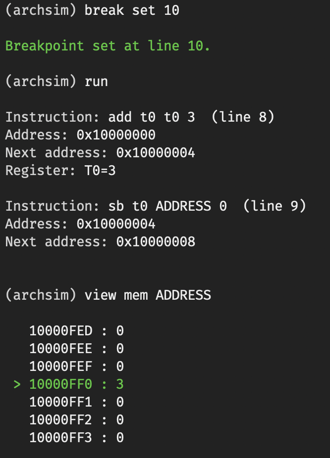

# ArchSim
Simulate RISC-V from the command line and browser. Project is still in development.



# Instructions
1. Requires an Odin compiler to build from source. Download at https://odin-lang.org/docs/install/
2. With the compiler installed and in your PATH, run the following sequence of commands
```bash
./build.sh r || build.bat r
out/archsim || out/archsim.exe
```
